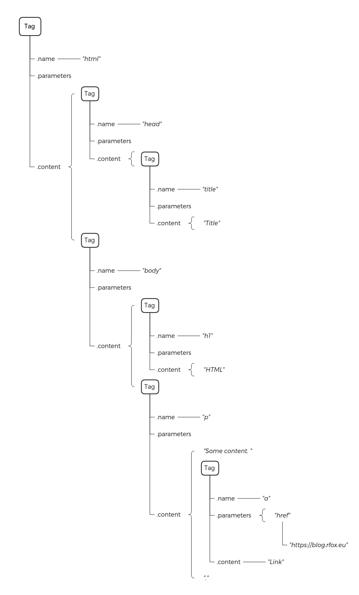

.. _index:

dhtmlparser3
============

dhtmlparser3 is a lightweight HTML/XML parser created for one purpose - quick and easy
picking selected tags from DOM.

It can be very useful when you are in need to write own "guerilla" API for some webpage, or a 
scrapper.

If you want, you can also create HTML/XML documents more easily than by joining strings.

The usage is super simple, and allows you to do things like pattern matching in the HTML tree.

Sources
-------
Source codes can be found here; https://github.com/Bystroushaak/dhtmlparser3

Installation
------------
dhtmlparser3 is hosted at pypi_, so you can install it using pip::

    pip3 install dhtmlparser3

.. _pypi: https://pypi.python.org/pypi/dhtmlparser3

Quick introduction
==================

Parse DOM
---------

The first thing you'll need to do in order to work with the HTML code is parse it into the DOM.

To do that, import the module and then call a :func:`.parse` on the text you want to parse.

::

    import dhtmlparser3

    example_html = """<html>
    <head><title>Title</title></head>
    <body>
    <h1>HTML</h1>
    
Some content. <a href="https://blog.rfox.eu">Link</a>.

    </body>
    </html>"""

    dom = dhtmlparser3.parse(example_html)

Now you have everything parsed in the tree structure of the :class:`.Tag` objects.

Find links
----------
Let's say that you want all links in the HTML. There is a handy method :meth:`.Tag.find`, which does exactly that:

::

    >>> dom.find("a")
    [Tag('a', parameters=SpecialDict([('href', 'https://blog.rfox.eu')]), nonpair=False)]

The parameters are as follows:

#. String name of the tag you want to find.
#. Dict with the parameters, to specify for example, class name.
#. (Lambda) function, which takes the tag as a parameter and should return ``True`` if it matches.

You can get the link from the tag using :attr:`.parameters` property:

::

    >>> a = dom.find("a")[0]
    >>> a.parameters["href"]
    'https://blog.rfox.eu'

The second important property is :attr:`.content`, where the content of the tag is stored.

::

    >>> a.content
    ['Link']

:attr:`.content` property consists of either :class:`.Tag`, :class:`.Comment`, or ``str`` objects. This is because the parser is trying to keep all of the information to be able to restore whitespace-perfect original representation of the HTML.

But in general, if you want a string from the content, call :meth:`.content_str`:

::

    >>> a.content_str()
    'Link'

Let's see the same example with the ``
`` tag:

::

    >>> dom.find("p")[0].content_str()
    'Some content. <a href="https://blog.rfox.eu">Link</a>.'

If you want the content without tags, you can call :meth:`.content_without_tags()`:

::

    >>> dom.find("p")[0].content_without_tags()
    'Some content. Link.'

Structure of the in-memory objects
----------------------------------

In order to be effective when working with the DOM, it is useful to understand how the tree actually looks in memory.

For example:

.. code-block:: html

    <html>
    <head><title>Title</title></head>
    <body>
    <h1>HTML</h1>
    
Some content. <a href="https://blog.rfox.eu">Link</a>.

    </body>
    </html>

is parsed to following structure:

Note, that the whitespaces are part of the :attr:`.content` properties.

Properties of the Tag object
----------------------------

As mentioned before, the :class:`.Tag` object basically consist of two properties :attr:`.parameters` and :attr:`.content`. First one contains dictionary for the tag parameters, second one contains everything that was in the HTML tag as a list.

Since writing ``.content`` and ``.prarameters`` is cumbersome, you can also use shortcuts :attr:`.p` and :attr:`.c` to access the same data:

::

    >>> dom = dhtmlparser3.parse('<tag param1="1" param2="2">  <content />  </tag>')
    >>> dom.p
    SpecialDict([('param1', '1'), ('param2', '2')])
    >>> dom.c
    ['  ', Tag('content', parameters=SpecialDict(), is_non_pair=True), '  ']

But the :class:`.Tag` objects also support dictionary-like interface, so you can access both :attr:`.parameters` and :attr:`.content` using square brackets:

::

    >>> dom["param1"]
    '1'
    >>> dom[0]
    Tag('content', parameters=SpecialDict(), is_non_pair=True)

Notice, that ``dom[0]`` returns expected tag, even though the :attr:`.content` property contains as a first element a whitespace:

::

    >>> dom.c
    ['  ', Tag('content', parameters=SpecialDict(), is_non_pair=True), '  ']

That is because it is not using the :attr:`.content` for access, but :attr:`.tags` property, which returns only tags:

::

    >>> dom.tags
    [Tag('content', parameters=SpecialDict(), is_non_pair=True)]

Square brackets can be also used for setting and deleting the sub-elements:

::

    >>> dom[0] = dhtmlparser3.Tag("new_content", {"param": "new_param"},  is_non_pair=True)
    >>> str(dom)
    '<tag param1="1" param2="2">  <new_content param="new_param" />  </tag>'

::

    >>> del dom[0]
    >>> str(dom)
    '<tag param1="1" param2="2">    </tag>'

Inserting tags using square brackets
++++++++++++++++++++++++++++++++++++

To make your life a bit easier, you can also insert tags using square brackets with slices. This is similar to calling ``.insert()`` method on a list, but it does support ``-1`` as an index for appending:

::

    >>> dom[0:] = dhtmlparser3.Tag("test", is_non_pair=True)
    >>> dom[-1:] = dhtmlparser3.Tag("another", is_non_pair=True)
    >>> str(dom)
    '<tag param1="1" param2="2"><test />    <another /></tag>'

Note that the whitespaces were not affected, as the tags were `inserted`, not replaced.

Looking for specific things
---------------------------

Most common usage of the dhtmlparser3 is to look for specific things. For this, there are two handy methods :meth:`.find` and :meth:`.wfind`. First one traverses the tree depth first, second breadth first.

Usually, you'll probably use :meth:`.find`.

Let's see an example::

    dom = dhtmlparser3.parse("""
        

          <figure id="d4cb77d7-f9fe-4796-b38c-f84ac9efb178" class="link-to-page">
            <h1><a class="unroll_category" href="en/Weekly_updates.html" title="Weekly updates">📂 <u>Category: <em>Weekly updates</em></u></a></h1>
            

              <h4><a class="" href="en/Weekly_updates/Newsletter_2021-10-29_Monster_post.html" title="Newsletter 2021-10-29; Monster post">📄 Newsletter 2021-10-29; Monster post</a> <time>(@2021-10-29)</time></h4>
              
<em>Some of the more important points in my year, and also general update regarding the tinySelf, objWiki and other projects of mine. Expect a lot of text.</em>

            

            

              <h4><a class="" href="en/Weekly_updates/Newsletter_2021-01-08_Defragmentation_in_progress.html" title="Newsletter 2021-01-08; Defragmentation in progress">📄 Newsletter 2021-01-08; Defragmentation in progress</a> <time>(@2021-01-08)</time></h4>
              
<em>Opensource contributions, book report, improvements, published blogposts and generally progress in my life and work.</em>

            

            

              <h4><a class="" href="en/Weekly_updates/Newsletter_2020-09-12_Waves_of_productivity.html" title="Newsletter 2020-09-12; Waves of productivity">📄 Newsletter 2020-09-12; Waves of productivity</a> <time>(@2020-09-12)</time></h4>
              
<em>Some of the stuff I did in last month and a half.</em>

            

            <h4 style="text-align: right;"><a href="en/Weekly_updates.html" title="Weekly updates">& 23 more blogposts</a></h4>
          </figure>
          <figure id="aaede967-1ab7-4910-ba42-5ea5f8ee480f" class="link-to-page">
            <h1><a class="unroll_category" href="en/Technological_marvels.html" title="Technological marvels">📂 <u>Category: <em>Technological marvels</em></u></a></h1>
            

              <h4><a class="" href="en/Technological_marvels/Microtron_under_the_Vitkov_Hill.html" title="Microtron under the Vítkov Hill">📄 Microtron under the Vítkov Hill</a> <time>(last modified @2021-06-26)</time></h4>
              
<em>Introduction to rare particle accelerator in Prague.</em>

            

            

              <h4><a class="" href="en/Technological_marvels/LVR-15_research_reactor_near_Prague.html" title="LVR-15 research reactor near Prague">📄 LVR-15 research reactor near Prague</a> <time>(@2019-11-24)</time></h4>
              
<em>Notes from my visit of Czechoslovakian LVR-15 research nuclear reactor in Řež near Prague.</em>

            

            

              <h4><a class="" href="en/Technological_marvels/The_beauty_of_a_fusion_reactor.html" title="The beauty of a fusion reactor">📄 The beauty of a fusion reactor</a> <time>(@2019-06-12)</time></h4>
              
<em>Introduction of interesting research fusion reactor built in Germany. Contains a lot of pictures.</em>

            

          </figure>
        

    """)

Let's say, that I want to obtain all links that point to the weekly updates category:

::

    >>> dom.find("a", fn=lambda x: x.p.get("href", "").startswith("en/Weekly"))
    [Tag('a', parameters=SpecialDict([('class', 'unroll_category'), ('href', 'en/Weekly_updates.html'), ('title', 'Weekly updates')]), is_non_pair=False),
     Tag('a', parameters=SpecialDict([('class', ''), ('href', 'en/Weekly_updates/Newsletter_2021-10-29_Monster_post.html'), ('title', 'Newsletter 2021-10-29; Monster post')]), is_non_pair=False),
     Tag('a', parameters=SpecialDict([('class', ''), ('href', 'en/Weekly_updates/Newsletter_2021-01-08_Defragmentation_in_progress.html'), ('title', 'Newsletter 2021-01-08; Defragmentation in progress')]), is_non_pair=False),
     Tag('a', parameters=SpecialDict([('class', ''), ('href', 'en/Weekly_updates/Newsletter_2020-09-12_Waves_of_productivity.html'), ('title', 'Newsletter 2020-09-12; Waves of productivity')]), is_non_pair=False),
     Tag('a', parameters=SpecialDict([('href', 'en/Weekly_updates.html'), ('title', 'Weekly updates')]), is_non_pair=False)]

As you can see, I am using lambda parameter to match specific part of the URL.

Note that I am specifically using ``x.p.get("href", "")`` to access the ``href`` parameter, because not every ``<a>`` element has to have it set, in which case it will cause and exception.

To obtain the URL's, all I need to do is use simple list comprehension::

    >>> links = dom.find("a", fn=lambda x: x.p.get("href", "").startswith("en/Weekly"))
    >>> [f"https://blog.rfox.eu/{x['href']}" for x in links]
    ['https://blog.rfox.eu/en/Weekly_updates.html',
     'https://blog.rfox.eu/en/Weekly_updates/Newsletter_2021-10-29_Monster_post.html',
     'https://blog.rfox.eu/en/Weekly_updates/Newsletter_2021-01-08_Defragmentation_in_progress.html',
     'https://blog.rfox.eu/en/Weekly_updates/Newsletter_2020-09-12_Waves_of_productivity.html',
     'https://blog.rfox.eu/en/Weekly_updates.html']

If I wanted content of the tags, it would be as simple as::

    >>> [x.content_without_tags() for x in links]
    ['📂 Category: Weekly updates',
     '📄 Newsletter 2021-10-29; Monster post',
     '📄 Newsletter 2021-01-08; Defragmentation in progress',
     '📄 Newsletter 2020-09-12; Waves of productivity',
     '& 23 more blogposts']

More complex example may include matching the elements in the tree, for example select all links, which don't have ``
`` as a parent, but have ``class`` parameter set to ``active``:

    >>> dom = dhtmlparser3.parse("""
    

      <a href="not this" class="active">link</a>
      <a href="not this">link</a>
      
        <a href="not this">link</a>
        <a href="this one" class="active">this one</a>
      
    

    """)
    >>> dom.find("a", {"class": "active"}, fn=lambda x: x.parent.name != "div")
    [Tag('a', parameters=SpecialDict([('href', 'this one'), ('class', 'active')]), is_non_pair=False)]

:meth:`.match`
++++++++++++++
In addition to :meth:`.find`, there is also :meth:`.match`. What it does is that it matches the paths specified by the arguments::

    >>> dom.match("span", "a")
    [Tag('a', parameters=SpecialDict([('href', 'not this')]), is_non_pair=True),
     Tag('a', parameters=SpecialDict([('href', 'this one'), ('class', 'active')]), is_non_pair=False)]

As you can see, the elements which are ``<a>`` tags in ```` were matched. You can use all arguments that :meth:`.find` takes as dictionaries (``**kwargs``)::

    >>> dom.match("span", {"name": "a", "p": {"class": "active"}})
    [Tag('a', parameters=SpecialDict([('href', 'this one'), ('class', 'active')]), is_non_pair=False)]

or lists (``*args``)::

    >>> dom.match("span", ["a", {"class": "active"}])
    [Tag('a', parameters=SpecialDict([('href', 'this one'), ('class', 'active')]), is_non_pair=False)]

This way, you can look for patterns and sub-patterns and so on.

:meth:`.wfind`
++++++++++++++
:meth:`.wfind` implements similar pattern matching to :meth:`.match`, but always wraps the result in the empty container object. This way, it is possible to chain the calls (which is not possible for :meth:`.find` and :meth:`.match`, because they return ``list``)::

    >>> dom.wfind("span").wfind("a")
    Tag(name="", content=[Tag('a', parameters=SpecialDict([('href', 'not this')]), is_non_pair=False), Tag('a', parameters=SpecialDict([('href', 'this one'), ('class', 'active')]), is_non_pair=False)])

BTW, you can check if the returned container matches anything, by using ``if`` condition on the whole container, because it implements bool magic method::

    >>> bool(dom.wfind("span").wfind("a"))
    True
    >>> bool(dom.wfind("blah"))
    False

So for example::

    if dom.wfind("span").wfind("a"):
      # .. do something

Other useful things to know
---------------------------

:meth:`.remove`
+++++++++++++++

:meth:`.remove` will remove given element from the sub-tree. The element has to be an actual element from the tree, that is the result of :meth:`.find` call or some other method of traversal of the tree.

For example, to remove all links::

    >>> for link in dom.find("a", {"href": "not this"}):
    ...  dom.remove(link)
    ...
    True
    True
    True
    >>> print(str(dom))

    

      

        <a href="this one" class="active">this one</a>
      
    

:meth:`.Tag.prettify`
+++++++++++++++++++++

As you can see, a lot of whitespaces were left. To get rid of them, you can call :meth:`.Tag.prettify`::

    >>> print(dom.prettify())
    

      
        <a href="this one" class="active">this one</a>
      
    

:meth:`.replace_with`
+++++++++++++++++++++

You can replace tags by calling :meth:`.replace_with`, and depending on the ``keep_content`` parameter (default ``True``), it will keep the content same:

    >>> dom.find("span")[0].replace_with(dhtmlparser3.Tag("p"))
    >>> print(dom.prettify())
    

      

        <a href="this one" class="active">this one</a>
      

    

Create DOM
++++++++++
And you can of course create the DOM from scratch::

    >>> from dhtmlparser3 import Tag
    >>> xml = Tag("xml")
    >>> xml[0:] = Tag("container")
    >>> xml[0][-1:] = Tag("item", {"parameter": "value"}, ["content"])
    >>> xml[0][-1:] = Tag("item", {"parameter": "another value"}, ["another content"])
    >>> print(xml.prettify())
    <xml>
      <container>
        <item parameter="value">content</item>
        <item parameter="another value">another content</item>
      </container>
    </xml>

Things that may be useful to know
---------------------------------

Parsing is case sensitive.

Matching using :meth:`.find` is case insensitive. You can make it case sensitive by setting ``case_sensitive`` parameter to ``True``.

Instead of :meth:`.find`, you can call :meth:`.find_depth_first_iter` to get lazy evaluated iterator.

You can compare elements using ``==``, and it will compare only equality of :attr:`.name`, :attr:`.parameters` and :attr:`.is_non_pair`, not the subtree.

It is possible to iterate over tags in given element by simply using it in ``for`` loop. This will skip whitespaces.

If you want ``bytes`` representation of the DOM string, call ``bytes(dom)`` and it will work.

All elements have :attr:`.parent` set by default. If you insert new elements using square brackets operator, it will be correctly set. If you however set new part of the sub-tree manually by inserting it to :attr:`.content`, you have to set it manually, or call :meth:`.double_link` on the element where you've inserted it.

:func:`.parse` returns either root element, or virtual container element, which is :class:`.Tag` with empty name, if there are multiple root elements.

Non-pair elements are autodetected even if they are not valid HTML, and parser should in general handle gracefully malformed HTML.

Non-key-value parameters like for example ``<tag rectangle>`` are parsed to empty value in :attr:`.parameters`::

    >>> dhtmlparser3.parse("<tag rectangle>")
    Tag('tag', parameters=SpecialDict([('rectangle', '')]), is_non_pair=True)
    >>> str(dhtmlparser3.parse("<tag rectangle>"))
    '<tag rectangle />'

Notice how the tag was correctly recognized as non-pair.

Package content
===============

.. toctree::
    :maxdepth: 1

    /api/dhtmlparser3
    /api/dhtmlparser3.tag
    /api/dhtmlparser3.comment
    /api/dhtmlparser3.parser
    /api/dhtmlparser3.tokenizer
    /api/dhtmlparser3.tokens
    /api/dhtmlparser3.quoter
    /api/dhtmlparser3.specialdict

Unittests
---------
Almost everything should be tested. You can run the tests like this::

    $ export PYTHONPATH="src/:$PYTHONPATH"
    $ py.test
    ============================= test session starts ==============================
    platform linux -- Python 3.8.10, pytest-6.2.5, py-1.11.0, pluggy-1.0.0
    rootdir: /home/bystrousak/Desktop/Syncthing/c0d3z/python/libs/pyDHTMLParser3
    collected 101 items

    tests/test_comment.py .                                                  [  0%]
    tests/test_escapers.py ..                                                [  2%]
    tests/test_parser.py ..........                                          [ 12%]
    tests/test_specialdict.py ............                                   [ 24%]
    tests/test_tag.py ......................................                 [ 62%]
    tests/test_tokenizer.py ......................................           [100%]

    ============================= 101 passed in 0.16s ==============================

Indices and tables
==================

* :ref:`genindex`
* :ref:`modindex`
* :ref:`search`
